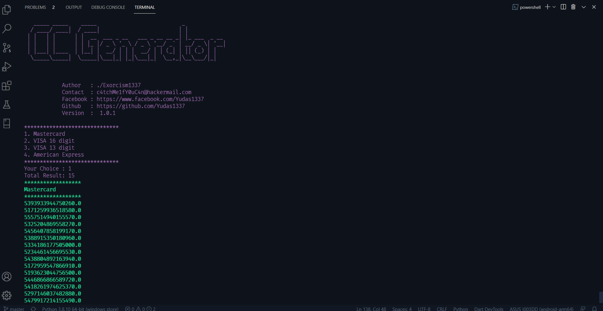

<pre>
<code>
   _____ _____    _____                           _             
  / ____/ ____|  / ____|                         | |            
 | |   | |      | |  __  ___ _ __   ___ _ __ __ _| |_ ___  _ __ 
 | |   | |      | | |_ |/ _ \ '_ \ / _ \ '__/ _` | __/ _ \| '__|
 | |___| |____  | |__| |  __/ | | |  __/ | | (_| | || (_) | |   
  \_____\_____|  \_____|\___|_| |_|\___|_|  \__,_|\__\___/|_|   
                                                                
                                                                                                        
</code>
</pre>

# CC Generator :
CC Generator is a tools for generate dummy creditcards using Luhn Algorithm pattern

# Requirements :
How To use : <code>python3 cc.py</code>

CopyRights | legal Claimers :

<ul>
<li>Author : ./Exorcism1337</li>
</ul>

# Technologies :
<li>Luhn Algorithm</li>
<li>Python 3.8.10</li>

# Preview CC Generator :

